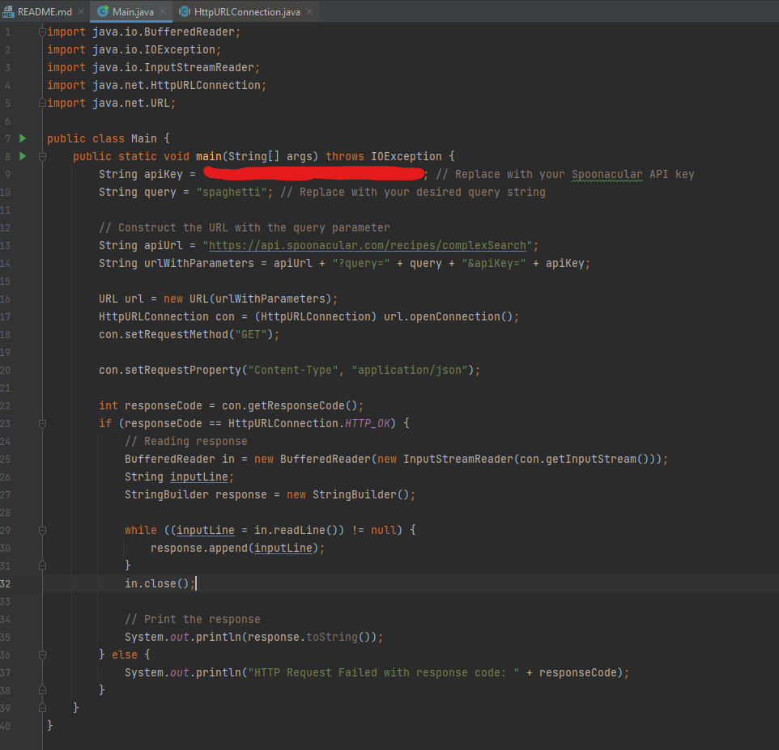
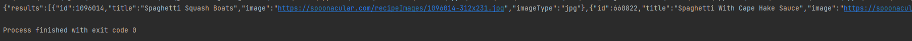

# Week 3 Project 
Group Members: Dhruv Patel, Brad Gardea, Goncalo Mendes
### Problem Domain
The problem domain we have chosen for our project is Recipe Planning. More specifically, Recipe Generation from a list of ingredients.

### Application Specifics
We are planning to create an application that allows users to find recipes
depending on what ingredients they have in their fridge. In addition, they would be
able to add other parameters such as the type of cuisine they like and the macros they want the meal to have.
In addition, we plan to implement a login system and a database that can keep track of what ingredients the users already have
so they don't have to manually enter this information each time they use the application. 

One API that we found for this project is the Spoonacular API.
https://spoonacular.com/food-api/docs

### Using the API:

The code to run the API is included in the project, the code itself is as follows:

The output of making this request is as follows:

